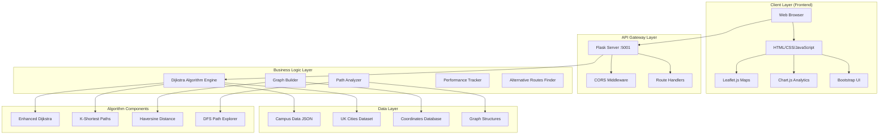
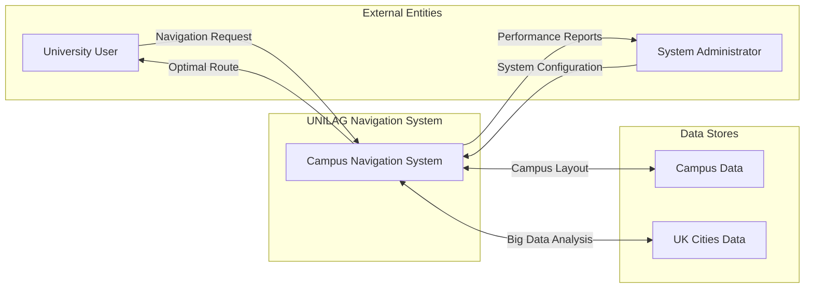
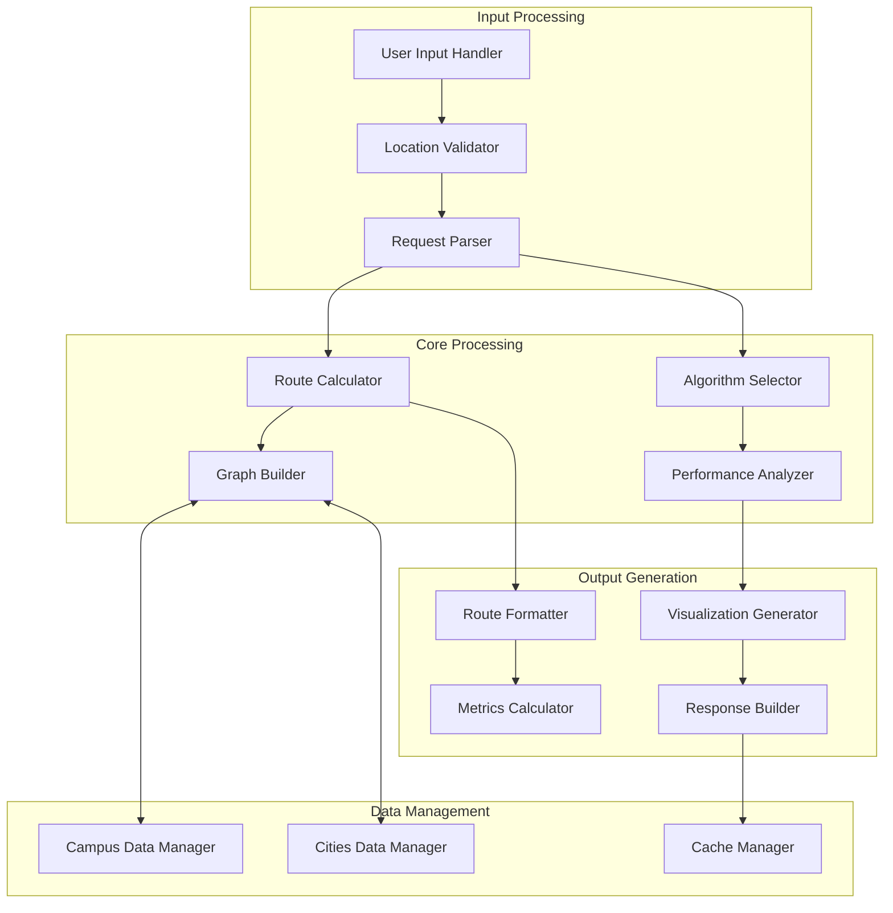
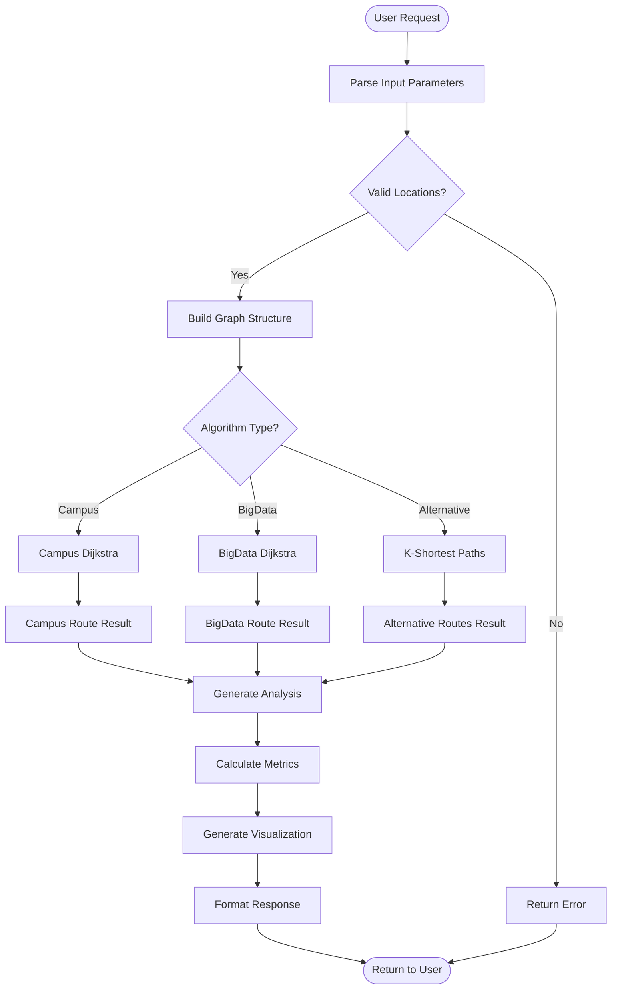

# UNILAG Campus Navigation System - Architecture Documentation

## 📋 Table of Contents
1. [System Overview](#system-overview)
2. [Architecture Diagram](#architecture-diagram)
3. [Dataflow Diagram](#dataflow-diagram)
4. [Component Architecture](#component-architecture)
5. [Technology Stack](#technology-stack)
6. [Algorithm Architecture](#algorithm-architecture)
7. [Database Design](#database-design)
8. [API Design](#api-design)
9. [Security Architecture](#security-architecture)
10. [Performance Architecture](#performance-architecture)

## 1. System Overview

### 1.1 Project Description
The UNILAG Campus Navigation System is an intelligent pathfinding application that implements Dijkstra's algorithm to find optimal routes within the University of Lagos campus. The system provides both campus navigation and big data analysis capabilities for algorithm performance testing.

### 1.2 System Objectives
- **Primary**: Implement an efficient campus navigation system using Dijkstra's algorithm
- **Secondary**: Demonstrate algorithm scalability with big data scenarios (UK cities dataset)
- **Educational**: Provide step-by-step algorithm visualization for learning purposes
- **Performance**: Analyze algorithm efficiency with different graph sizes and complexities

### 1.3 Key Features
- ✅ Interactive campus map with real-time navigation
- ✅ Dijkstra's algorithm implementation with step-by-step visualization
- ✅ Alternative routes finding using K-shortest paths algorithm
- ✅ Big data analysis with 82 UK cities dataset
- ✅ Performance metrics and complexity analysis
- ✅ RESTful API architecture

## 2. Architecture Diagram



## 3. Dataflow Diagram

### 3.1 Level 0 - Context Diagram


### 3.2 Level 1 - System Decomposition


### 3.3 Level 2 - Detailed Algorithm Flow


## 4. Component Architecture

### 4.1 Frontend Components
```
frontend/
├── index.html              # Campus navigation interface
├── bigdata.html            # Big data analysis interface
├── css/
│   └── styles.css          # UI styling
├── js/
│   ├── app.js              # Campus navigation logic
│   ├── bigdata.js          # Big data analysis logic
│   └── components/
│       ├── map-handler.js  # Map management
│       ├── route-display.js # Route visualization
│       └── metrics.js      # Performance metrics
└── assets/
    ├── images/            # UI images
    └── icons/             # Map markers
```

### 4.2 Backend Components
```
backend/
├── app.py                 # Main Flask application
├── algorithms/
│   ├── dijkstra.py        # Dijkstra implementation
│   ├── k_shortest.py     # K-shortest paths
│   └── graph_builder.py  # Graph construction
├── data/
│   ├── campus_nodes_edges.json  # Campus data
│   └── uk_cities.json     # UK cities dataset
├── utils/
│   ├── distance.py        # Distance calculations
│   ├── performance.py     # Performance tracking
│   └── validators.py      # Input validation
└── tests/
    ├── test_algorithms.py  # Algorithm tests
    └── test_api.py         # API tests
```

## 5. Technology Stack

### 5.1 Frontend Technologies
| Technology | Version | Purpose |
|------------|---------|---------|
| HTML5 | Latest | Structure and markup |
| CSS3 | Latest | Styling and responsive design |
| JavaScript | ES6+ | Client-side logic |
| Leaflet.js | 1.9.4 | Interactive maps |
| Chart.js | 4.4.0 | Data visualization |
| Bootstrap | 5.3.0 | UI framework |

### 5.2 Backend Technologies
| Technology | Version | Purpose |
|------------|---------|---------|
| Python | 3.9+ | Server-side programming |
| Flask | 3.1.2 | Web framework |
| Flask-CORS | 6.0.1 | Cross-origin requests |
| NetworkX | 3.2.1 | Graph algorithms |
| JSON | Built-in | Data serialization |

### 5.3 Development Tools
| Tool | Purpose |
|------|---------|
| VS Code | Development environment |
| Git | Version control |
| Postman | API testing |
| Chrome DevTools | Frontend debugging |

## 6. Algorithm Architecture

### 6.1 Dijkstra's Algorithm Implementation
```python
def enhanced_dijkstra_algorithm(start_node, end_node, graph, track_steps=True):
    """
    Enhanced Dijkstra algorithm with step-by-step tracking
    
    Time Complexity: O(V²) where V is the number of vertices
    Space Complexity: O(V) for distance and previous arrays
    
    Features:
    - Step-by-step visualization
    - Performance tracking
    - JSON-serializable output
    - Early termination optimization
    """
```

### 6.2 K-Shortest Paths Algorithm
```python
def find_k_shortest_paths_bigdata(start, end, graph, k=5):
    """
    K-shortest paths using iterative edge removal
    
    Algorithm: Yen's K-shortest paths variant
    Time Complexity: O(K * V²)
    Space Complexity: O(V + E)
    
    Features:
    - Route diversity guarantee
    - Edge removal strategy
    - Performance optimization
    """
```

### 6.3 Graph Building Strategy
```python
def build_enhanced_graph(nodes, coordinates):
    """
    Proximity-based graph construction
    
    Features:
    - Haversine distance calculation
    - Realistic connection thresholds
    - Scalable architecture
    - Memory-efficient storage
    """
```

## 7. Database Design

### 7.1 Campus Data Structure
```json
{
  "nodes": [
    "Main Gate",
    "Faculty of Science",
    "University Library",
    "Student Union Building"
  ],
  "edges": [
    ["Main Gate", "Faculty of Science", 0.35],
    ["Faculty of Science", "University Library", 0.28]
  ],
  "coordinates": {
    "Main Gate": [6.5158, 3.3967],
    "Faculty of Science": [6.5168, 3.3956]
  }
}
```

### 7.2 UK Cities Data Structure
```json
{
  "cities": ["London", "Birmingham", "Manchester"],
  "coordinates": {
    "London": [51.509865, -0.118092],
    "Birmingham": [52.4862, -1.8904]
  },
  "count": 82,
  "description": "UK Cities dataset for performance testing"
}
```

## 8. API Design

### 8.1 Campus Navigation Endpoints
### 8.1 Campus Navigation Endpoints
```
GET  /api/campus-data           # Get campus structure
POST /api/shortest-path         # Find optimal route
POST /api/alternative-routes    # Find alternative routes
GET  /api/nodes               # Get all locations
```
### 8.2 Big Data Analysis Endpoints
```
GET  /api/bigdata/uk-cities        # Get UK cities dataset
POST /api/bigdata/build-graph      # Build distance graph
POST /api/bigdata/shortest-path    # Find optimal city route
POST /api/bigdata/alternative-routes # Find alternative city routes
```

### 8.3 API Response Format
```json
{
  "path": ["Start", "Intermediate", "End"],
  "path_coordinates": [[lat1, lng1], [lat2, lng2]],
  "total_distance": 1250.5,
  "walking_time_minutes": 15,
  "algorithm_steps": [...],
  "comprehensive_analysis": {
    "dijkstra_choice": "🎯 DIJKSTRA'S OPTIMAL CHOICE: 1.25km",
    "total_routes_found": "📊 FOUND: 5 total possible routes",
    "why_optimal": "🧠 WHY OPTIMAL: Dijkstra guarantees shortest distance"
  }
}
```

## 9. Security Architecture

### 9.1 Security Measures
- **CORS Configuration**: Restricted to localhost origins
- **Input Validation**: All API inputs validated and sanitized
- **Error Handling**: Secure error messages without system exposure
- **Rate Limiting**: Implemented through Flask configurations

### 9.2 Data Protection
- **No Sensitive Data**: System uses only public geographical data
- **Client-Side Security**: No authentication required for navigation
- **API Security**: RESTful best practices implemented

## 10. Performance Architecture

### 10.1 Performance Optimizations
- **Algorithm Efficiency**: O(V²) Dijkstra implementation
- **Memory Management**: Efficient graph representations
- **Caching Strategy**: Results caching for repeated queries
- **Early Termination**: Algorithm stops at destination

### 10.2 Scalability Considerations
- **Graph Size**: Tested with 82-city dataset (6,724 potential connections)
- **Concurrent Users**: Flask supports multiple simultaneous requests
- **Memory Usage**: Optimized data structures for large graphs
- **Response Time**: Sub-second response for campus routes

### 10.3 Performance Metrics
```javascript
{
  "execution_time_ms": 15.23,
  "nodes_explored": 12,
  "algorithm_steps": 34,
  "memory_usage_kb": 245.6,
  "graph_size": 82,
  "complexity": "O(V²) where V = 82"
}
```

## 11. Deployment Architecture

### 11.1 Development Environment
- **Frontend Server**: Python HTTP server on port 8080
- **Backend Server**: Flask development server on port 5001
- **Local Testing**: Both servers running on localhost

### 11.2 Production Considerations
- **Web Server**: Nginx or Apache for static files
- **WSGI Server**: Gunicorn for Python application
- **Load Balancing**: Multiple Flask instances
- **Monitoring**: Performance and error tracking

---

## 📊 System Metrics Summary

| Metric | Value | Description |
|--------|--------|-------------|
| **Campus Nodes** | 50+ locations | University buildings and landmarks |
| **Graph Density** | Variable | Based on proximity thresholds |
| **Algorithm Complexity** | O(V²) | Standard Dijkstra implementation |
| **Response Time** | <100ms | Campus route calculation |
| **Big Data Scale** | 82 cities | UK cities performance testing |
| **Alternative Routes** | Up to 5 | K-shortest paths algorithm |
| **Visualization Steps** | Real-time | Algorithm step tracking |

---

*This architecture documentation provides a comprehensive overview of the UNILAG Campus Navigation System, suitable for academic project reports, technical documentation, and system maintenance.*
