# UNILAG Campus Navigation - Visual Diagrams

## 📊 System Architecture Diagrams

### 1. High-Level System Architecture


### 2. Detailed Component Architecture


### 3. Data Flow Diagram - Level 0 (Context)

```mermaid
graph LR
    subgraph "External Entities"
        USER[👤 University Users]
        ADMIN[👨‍💼 System Admin]
        DEV[👨‍💻 Developers]
    end
    
    subgraph "UNILAG Navigation System"
        SYSTEM[🏛️ Campus Navigation System]
    end
    
    subgraph "External Data"
        OSM[🗺️ OpenStreetMap]
        CAMPUS[🏫 Campus Data]
        CITIES[🌍 UK Cities Data]
    end
    
    USER -->|Navigation Requests| SYSTEM
    SYSTEM -->|Optimal Routes| USER
    ADMIN -->|Configuration| SYSTEM
    SYSTEM -->|Reports| ADMIN
    DEV -->|Algorithm Updates| SYSTEM
    SYSTEM -->|Performance Data| DEV
    
    SYSTEM <-->|Map Tiles| OSM
    SYSTEM <-->|Location Data| CAMPUS
    SYSTEM <-->|Big Data| CITIES
```



### 4. Data Flow Diagram - Level 1 (System Processes)


### 5. Algorithm Flow Diagram

```mermaid
graph TD
    START([🚀 Start]) --> INPUT[📝 Parse User Input]
    INPUT --> VALIDATE{✅ Valid Locations?}
    
    VALIDATE -->|❌ No| ERROR[⚠️ Return Error Message]
    VALIDATE -->|✅ Yes| GRAPH[🔧 Build Graph Structure]
    
    GRAPH --> ALGO{🔀 Select Algorithm}
    ALGO -->|🏫 Campus| DIJKSTRA_CAMPUS[🎯 Campus Dijkstra]
    ALGO -->|🌍 Big Data| DIJKSTRA_BIG[📊 BigData Dijkstra]
    ALGO -->|🔄 Alternatives| K_SHORTEST[🛤️ K-Shortest Paths]
    
    DIJKSTRA_CAMPUS --> STEPS_CAMPUS[📚 Track Algorithm Steps]
    DIJKSTRA_BIG --> PERFORMANCE[⚡ Performance Tracking]
    K_SHORTEST --> DIVERSITY[🌐 Route Diversity Analysis]
    
    STEPS_CAMPUS --> ANALYSIS[📋 Generate Analysis]
    PERFORMANCE --> ANALYSIS
    DIVERSITY --> ANALYSIS
    
    ANALYSIS --> METRICS[📈 Calculate Metrics]
    METRICS --> VISUALIZE[🎨 Generate Visualization]
    VISUALIZE --> RESPONSE[📤 Format Response]
    RESPONSE --> END([🏁 Return to User])
    
    ERROR --> END
    
    style START fill:#4CAF50
    style END fill:#FF9800
    style ERROR fill:#F44336
    style ANALYSIS fill:#2196F3
```



### 6. Database Schema Diagram


### 7. API Architecture Diagram

```mermaid
graph TB
    subgraph "Client Applications"
        WEB[🌐 Web Browser]
        MOBILE[📱 Mobile App]
        API_CLIENT[🔧 API Client]
    end
    
    subgraph "API Gateway Layer"
        CORS[🔒 CORS Middleware]
        RATE[⏱️ Rate Limiting]
        AUTH[🔐 Authentication]
        ROUTER[🚦 Route Handler]
    end
    
    subgraph "Business Logic"
        CAMPUS_API[🏫 Campus Navigation API]
        BIGDATA_API[📊 Big Data API]
        METRICS_API[📈 Metrics API]
    end
    
    subgraph "Core Services"
        DIJKSTRA[🎯 Dijkstra Service]
        K_SHORTEST[🛤️ K-Shortest Service]
        GRAPH_SERVICE[🔧 Graph Service]
        DISTANCE_SERVICE[📏 Distance Service]
    end
    
    WEB --> CORS
    MOBILE --> CORS
    API_CLIENT --> CORS
    
    CORS --> RATE
    RATE --> AUTH
    AUTH --> ROUTER
    
    ROUTER --> CAMPUS_API
    ROUTER --> BIGDATA_API
    ROUTER --> METRICS_API
    
    CAMPUS_API --> DIJKSTRA
    BIGDATA_API --> K_SHORTEST
    METRICS_API --> GRAPH_SERVICE
```



### 8. Deployment Architecture


### 9. Performance Monitoring Flow

```mermaid
graph LR
    subgraph "Request Processing"
        REQ[Incoming Request] --> START_TIMER[Start Performance Timer]
        START_TIMER --> PROCESS[Process Algorithm]
        PROCESS --> END_TIMER[End Performance Timer]
        END_TIMER --> RESPONSE[Send Response]
    end
    
    subgraph "Metrics Collection"
        COLLECT[Collect Metrics]
        STORE[Store in Memory]
        AGGREGATE[Aggregate Data]
        VISUALIZE[Generate Charts]
    end
    
    subgraph "Performance Analysis"
        ANALYZE[Analyze Trends]
        ALERT[Performance Alerts]
        OPTIMIZE[Optimization Suggestions]
        REPORT[Performance Reports]
    end
    
    END_TIMER --> COLLECT
    COLLECT --> STORE
    STORE --> AGGREGATE
    AGGREGATE --> VISUALIZE
    
    AGGREGATE --> ANALYZE
    ANALYZE --> ALERT
    ANALYZE --> OPTIMIZE
    ANALYZE --> REPORT
    
    ALERT --> ADMIN[👨‍💼 System Admin]
    OPTIMIZE --> DEV[👨‍💻 Developer]
    REPORT --> STAKEHOLDERS[📊 Stakeholders]
```



### 10. Security Architecture

```mermaid
graph TB
    subgraph "Security Layers"
        subgraph "Network Security"
            FIREWALL[🔥 Firewall]
            HTTPS[🔒 HTTPS/TLS]
            CORS_SEC[🌐 CORS Policy]
        end
        
        subgraph "Application Security"
            INPUT_VAL[✅ Input Validation]
            RATE_LIMIT[⏱️ Rate Limiting]
            ERROR_HANDLE[⚠️ Secure Error Handling]
        end
        
        subgraph "Data Security"
            NO_SENSITIVE[🛡️ No Sensitive Data]
            PUBLIC_DATA[🌍 Public Geographic Data]
            AUDIT_LOG[📝 Audit Logging]
        end
    end
    
    CLIENT[👤 Client] --> FIREWALL
    FIREWALL --> HTTPS
    HTTPS --> CORS_SEC
    CORS_SEC --> INPUT_VAL
    INPUT_VAL --> RATE_LIMIT
    RATE_LIMIT --> ERROR_HANDLE
    ERROR_HANDLE --> NO_SENSITIVE
    NO_SENSITIVE --> PUBLIC_DATA
    PUBLIC_DATA --> AUDIT_LOG
```



## 📈 Performance Metrics Visualization

### Algorithm Complexity Analysis
```mermaid
graph LR
    subgraph "Time Complexity"
        TC1[O(V²) - Basic Dijkstra]
        TC2[O(V²log V) - Optimized Dijkstra]
        TC3[O(K×V²) - K-Shortest Paths]
    end
    
    subgraph "Space Complexity"
        SC1[O(V) - Distance Array]
        SC2[O(V) - Previous Array]
        SC3[O(V+E) - Graph Storage]
    end
    
    subgraph "Real Performance"
        RP1[45ms - Campus Navigation]
        RP2[75ms - Big Data Scenario]
        RP3[180ms - Alternative Routes]
    end
```

### System Performance Metrics


---

*These visual diagrams provide a comprehensive overview of the UNILAG Campus Navigation System architecture, data flow, and performance characteristics. They are suitable for technical documentation, project presentations, and system maintenance reference.*
